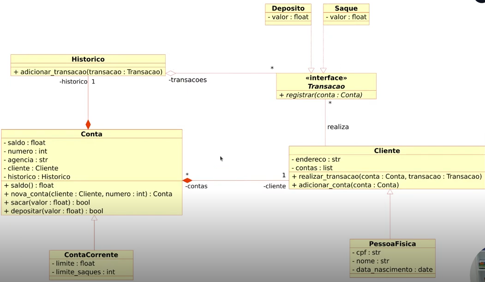

# Modelando o Sistema Bancário em POO com Python

## Objetivo Geral

Iniciar a modelagem do sistema bancário em POO. Adicionar classes para cliente e
as operações bancárias: depósito e saque.

Atualizar a implementação do sistema bancário, para armazenar os dados de 
clientes e contas bancárias em objetos ao invés de dicionários. O código deve
seguir o modelo de classes UML a seguir:

## Desafio extra

Após concluir a modelagem das classes e a criação dos métodos. Atualizar os 
métodos que tratam as oções do menu, para funcionarem com as classes modeladas.